 

 

---

## 👨‍💻 About me

**Systems Engineering student @ Universidad de Lima** · 9th cycle · Top 5%  
**AI & Omnichannel Innovation Lead @ Farmacias Peruanas SAC**

I work at the intersection of data, AI, and business impact. Currently leading agentic AI projects for technological acceleration at one of Peru's largest pharmacy chains — turning complex processes into automated, scalable systems.

My edge: I don't just build models. I bridge the gap between technical execution and strategic decision-making.

> 🌎 Lima, Perú &nbsp;·&nbsp; Español nativo &nbsp;·&nbsp; English B2 (TOEIC 880)

---

## 🚀 Currently building

| Project | Description | Stack |
|---|---|---|
| 🤖 Agentic AI Pipeline | Accelerating tech projects via AI agents at Farmacias Peruanas | Claude SDK · Python |
| 🧠 NLP Research (Tesis) | Inappropriate content detection model + Telegram Bot deployment | Python · NLP · scikit-learn |
| ⚙️ SDD Framework | Spec Driven Development methodology rollout across non-dev teams | Strategy · AI Tools |

---

## 🏆 Highlights

* 🌐 **AI & Innovation Lead** @ Farmacias Peruanas SAC — Dirección de Innovación y Omnicanalidad
* 🔬 **Huawei Seeds for the Future** — Nationally selected for 5G, AI & Cloud program (Nov. 2025)
* 🎓 **Top 5%** — Universidad de Lima, Ingeniería de Sistemas
* 🧪 **NLP Researcher** — Full ML pipeline: dataset creation → model training → Telegram deployment
* 🌱 **Volunteer @ Vocaciónate** — Data strategy for NGO impact measurement (Mar. 2026 – Present)
* ⚡ **Scrum Master** — Led full-stack team deploying Next.js + MySQL on Azure

---

## 🛠️ Tech Stack

**Languages**  

**AI & Data**  

**Web & Cloud**  

**Tools**  

---

## ⚡ Fun facts

- ☕ Powered by coffee and a compulsive need to automate everything
- 🕺 I dance and sing in my free time — no shame, full commitment
- 🎮 Video games and board games with friends are a non-negotiable ritual
- 🏆 Competitive soul: I play to win, and I bring everyone around me up with me
- 🌎 Building for Peru's digital transformation, one agent at a time

---

## 📬 Let's connect

---

